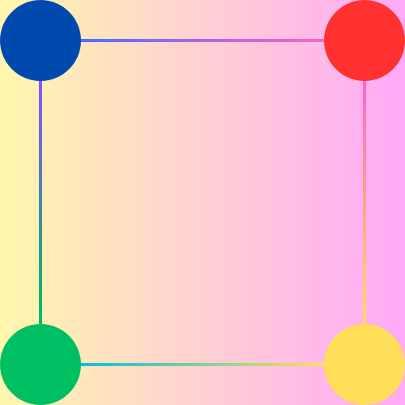

# Point-points Game



## Overview

Point-points is an interactive strategy game built with Flutter where players take turns marking points on a grid. When a player successfully marks four adjacent points to form a square, they score a point and get an extra turn. The game combines tactical thinking with strategic planning as players compete to create the most squares.

## Features

- **Customizable Grid Sizes**: Choose between 6×6, 8×8, 10×10, or 12×12 grid sizes
- **Color Selection**: Each player can select their unique color for gameplay
- **Score Tracking**: Real-time score tracking for both players
- **Interactive UI**: User-friendly interface with smooth animations
- **Turn-Based Gameplay**: Clear indicators for whose turn it is
- **Square Detection**: Automatic detection and highlighting of completed squares

## Getting Started

### Prerequisites

- Flutter SDK (latest stable version)
- Dart SDK (latest stable version)
- Android Studio or VS Code with Flutter plugins

### Installation

1. Clone this repository

   ```bash
   git clone https://github.com/gedeontiga/points-points-game.git
   ```

2. Navigate to the project directory

   ```bash
   cd points-points-game
   ```

3. Install dependencies

   ```bash
   flutter pub get
   ```

4. Run the app
   ```bash
   flutter run
   ```

## How to Play

1. **Launch the Game**: Open the app to see the splash screen
2. **Game Setup**:
   - Select your preferred grid size (6×6, 8×8, 10×10, or 12×12)
   - Choose unique colors for each player
3. **Gameplay**:
   - Players take turns marking points on the grid with their chosen color
   - When a player connects four adjacent points in their color to form a square, they:
     - Score a point
     - Get an additional turn
   - The game continues until all possible points are marked
4. **Winning**: The player with the highest score at the end wins

## Project Structure

```
lib/
├── core/                           # Core functionality
│   ├── utils/                      # Utility classes
│   │   ├── grid_preview_painter.dart
│   │   ├── point_painter.dart
│   │   └── square_painter.dart
│   ├── widgets/                    # Reusable widgets
│   │   ├── game_grid.dart
│   │   ├── player_score_board.dart
│   │   └── schedule_card.dart
│   └── services/                   # Services
│       └── game_notifier.dart
├── models/                         # Data models
│   ├── services/
│   │   ├── game_notifier.dart
│   ├── game_state.dart
│   ├── player.dart
│   ├── point.dart
│   └── square.dart
├── screens/                        # App screens
│   ├── game_screen.dart
│   ├── game_setting_dialog.dart
│   ├── spash_screen.dart
└── main.dart                       # Entry point
```

## Technical Implementation

The game is built using Flutter and follows a clean architecture approach:

- **State Management**: Using a custom `GameNotifier` to manage game state
- **Rendering**: Custom painters for grid, points, and squares
- **Models**: Structured data models for game elements
- **Screens**: Organized UI flow with dedicated screens for different states

## Contributing

Contributions are welcome! Please feel free to submit a Pull Request.

1. Fork the repository
2. Create your feature branch (`git checkout -b feature/amazing-feature`)
3. Commit your changes (`git commit -m 'Add some amazing feature'`)
4. Push to the branch (`git push origin feature/amazing-feature`)
5. Open a Pull Request

## License

This project is licensed under the MIT License - see the LICENSE file for details.

## Acknowledgments

- Thanks to all contributors who have helped shape this game
- Inspired by the classic paper-and-pencil game "Dots and Boxes"
